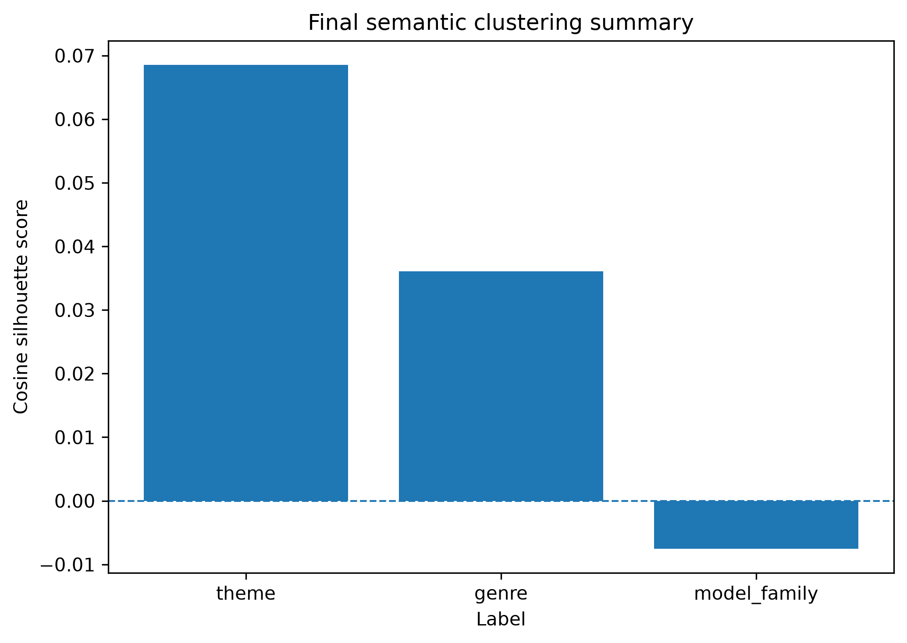
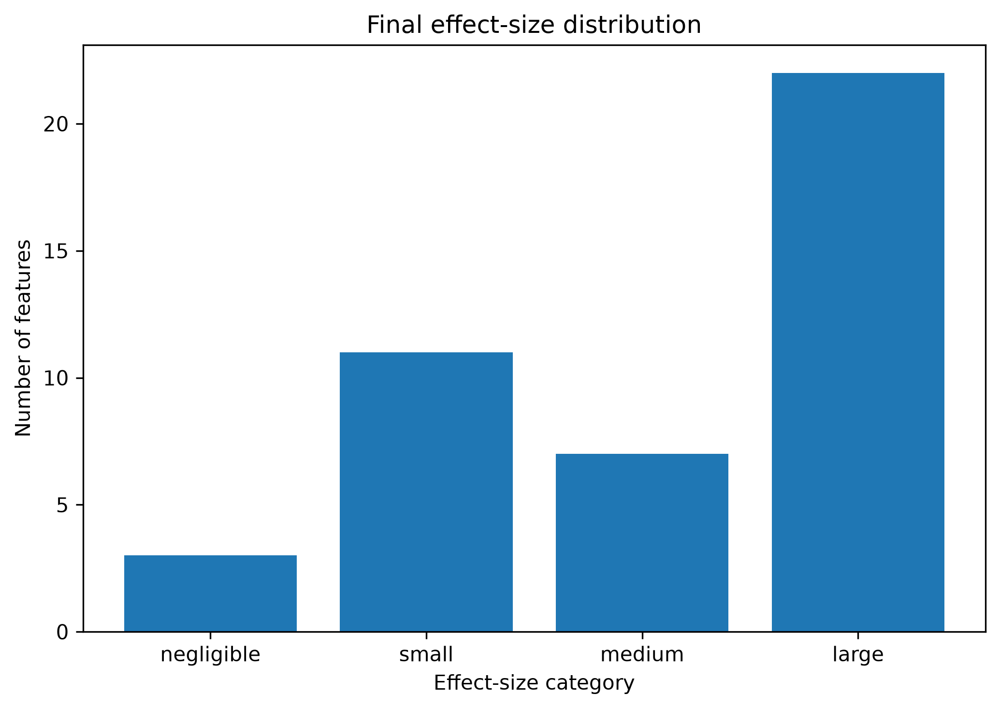
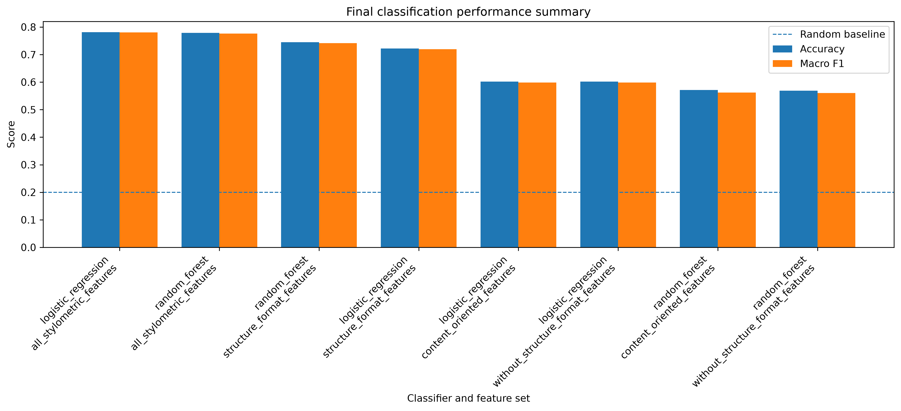
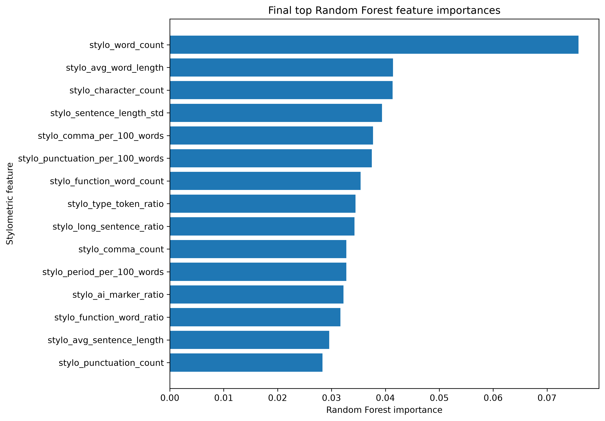
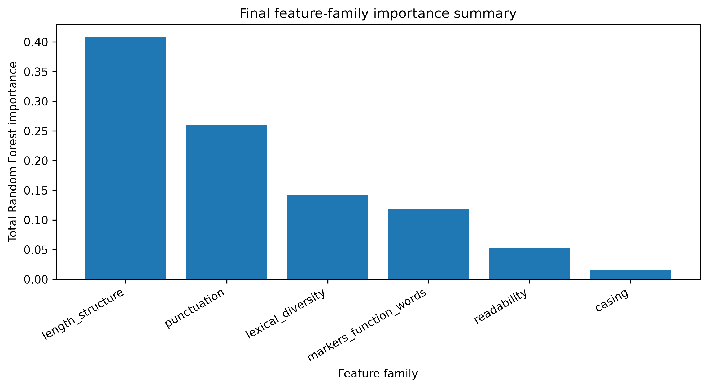

# Do Large Language Models Have a Writing Style?  
## A Stylometric Comparison of LLM-Generated Texts

**Author:** Viola Awor  
**Project area:** Natural Language Processing  
**Repository:** LLM Stylometric Fingerprinting  

---

## Abstract

Large language models produce fluent and semantically coherent text, but it remains an open practical question whether different model families also produce measurably different writing styles. This project investigates whether stylometric features can distinguish texts generated by different LLM families. A balanced corpus of 1,000 generated texts was constructed from five model families: GPT, Claude, DeepSeek, Gemini, and Mistral. Each model generated responses to the same controlled set of prompts across four genres: narrative, descriptive, argumentative, and dialogue. From each output, 43 stylometric features were extracted, including sentence-length statistics, punctuation usage, lexical diversity, function-word usage, readability, casing, and marker-based features.

The project evaluates model-family separability using semantic maps, non-parametric statistical tests, post-hoc pairwise comparisons, and supervised classification. Sentence-embedding maps show weak clustering by model family, with a model-family silhouette score of -0.0075. In contrast, stylometric analysis reveals strong model-family differences: 41 out of 43 features are significant after false-discovery-rate correction, and 22 features have large effects. Classification results further show that model family can be predicted from stylometric features with 78.1% accuracy and 0.780 macro F1 using Logistic Regression under prompt-aware cross-validation. Since the random baseline is 20%, the results suggest that LLM-generated texts contain measurable model-specific writing-style fingerprints.

---

# 1. Introduction

Large language models are increasingly used to generate essays, explanations, stories, business texts, and conversational responses. Because many modern LLMs are trained on large overlapping corpora and optimized to produce fluent natural language, their outputs can often appear similar at the level of meaning. However, similarity in semantic content does not necessarily imply similarity in writing style. Different model families may still display systematic stylistic habits in sentence structure, punctuation, lexical diversity, function-word usage, readability, and discourse patterns.

This project studies whether such model-specific writing habits can be measured. The central idea comes from stylometry, a field concerned with the quantitative analysis of writing style. Stylometry has traditionally been used in authorship attribution, where the goal is to identify or compare human authors based on linguistic features. In this project, the same general idea is adapted to machine-generated texts: instead of asking whether human authors have distinctive styles, the project asks whether LLM families have distinctive styles.

The task is relevant for several reasons. First, LLM-generated text detection is usually discussed as a binary problem: human versus AI. However, as more models become widely available, a more fine-grained question emerges: can we distinguish which model family generated a text? Second, if model-generated texts contain model-specific stylistic fingerprints, then stylometric analysis can provide a complementary view to semantic embeddings. Semantic embeddings measure similarity in meaning, while stylometric features measure how a text is written. Third, understanding model-specific style can help evaluate the diversity, detectability, and potential homogenization of LLM-generated writing.

The project therefore compares five LLM families: GPT, Claude, DeepSeek, Gemini, and Mistral. Each model responds to the same controlled prompt set, producing a balanced corpus of 1,000 texts. The analysis then extracts stylometric features and evaluates whether these features differ statistically across model families and whether they can predict the generating model family.

The emphasis of the project is not on maximizing classification accuracy, but on critically evaluating whether the proposed methodology is effective. For this reason, the project combines statistical testing, semantic mapping, feature importance analysis, and prompt-aware classification. This provides both predictive evidence and interpretability.

---

# 2. Research Question and Methodology

## 2.1 Research question

The project is guided by the following research question:

**Can stylometric features distinguish texts generated by different large language model families?**

This question is evaluated through measurable objectives:

1. Construct a balanced corpus of LLM-generated texts using controlled prompts.
2. Extract quantitative stylometric features from each generated output.
3. Test whether stylometric features differ significantly across model families.
4. Compare semantic separability with stylometric separability.
5. Train classifiers to predict the generating model family from stylometric features.
6. Critically interpret which feature families contribute most to model-family identification.

## 2.2 Formal problem definition

Let the dataset be defined as:

\[
D = \{(x_i, y_i, p_i)\}_{i=1}^{n}
\]

where:

- \(x_i\) is the generated text;
- \(y_i\) is the model-family label;
- \(p_i\) is the prompt identifier;
- \(n = 1000\) is the number of generated texts.

The model-family label belongs to the set:

\[
y_i \in \{\text{GPT}, \text{Claude}, \text{DeepSeek}, \text{Gemini}, \text{Mistral}\}
\]

Each text is transformed into a stylometric feature vector:

\[
\phi(x_i) \in \mathbb{R}^{43}
\]

where \(\phi(x_i)\) contains 43 stylometric measurements. The supervised classification problem is therefore:

\[
f: \mathbb{R}^{43} \rightarrow \{1,2,3,4,5\}
\]

where \(f\) predicts the model family from the stylometric representation of the text.

## 2.3 Dataset design

The dataset was constructed to reduce confounding effects. Each model family answered the same controlled prompt set. The prompts were distributed across four genres: narrative, descriptive, argumentative, and dialogue. Each generated response was constrained to approximately 180–220 words, with length-control prompts and validation used during data collection.

The final dataset is balanced across both model family and genre.

**Table 1. Dataset summary**

| Item | Value |
|---|---:|
| Total generated texts | 1,000 |
| Model families | 5 |
| Texts per model family | 200 |
| Genres | 4 |
| Texts per genre | 250 |
| Texts per model family per genre | 50 |
| Stylometric features | 43 |
| Prompt groups | 200 |

The balance is important because it ensures that classification and statistical testing are not biased by unequal class sizes. Each model contributes the same number of outputs, and each genre is equally represented.

## 2.4 Stylometric features

The project extracts 43 stylometric features from each generated output. These features are grouped into several categories:

1. **Length and sentence structure**
   - word count;
   - character count;
   - sentence count;
   - average sentence length;
   - sentence-length standard deviation;
   - minimum, maximum, and range of sentence length;
   - short-sentence ratio;
   - long-sentence ratio.

2. **Punctuation**
   - punctuation count;
   - comma count;
   - period count;
   - question-mark count;
   - exclamation-mark count;
   - semicolon count;
   - colon count;
   - dash count;
   - quote count;
   - punctuation rates per 100 words.

3. **Casing**
   - uppercase word count;
   - titlecase word count;
   - uppercase character ratio.

4. **Lexical diversity**
   - type-token ratio;
   - hapax legomena ratio;
   - repeated word ratio;
   - Yule’s K;
   - Simpson diversity;
   - Honore’s R;
   - moving-average type-token ratio.

5. **Discourse and marker features**
   - function-word count;
   - function-word ratio;
   - transition-marker count and ratio;
   - hedging-marker count and ratio;
   - AI-style marker count and ratio.

6. **Readability**
   - Flesch reading ease;
   - Gunning Fog index.

These features are designed to capture not only what the models write about, but how they write.

## 2.5 Semantic mapping

To compare stylometric separability with semantic separability, sentence embeddings were generated for the texts. Dimensionality reduction was applied using PCA and t-SNE. Clustering quality was measured with cosine silhouette scores for three labels:

- model family;
- genre;
- theme.

The silhouette score measures how close points are to other points in the same group compared with points in other groups. For a point \(i\), the silhouette value is:

\[
s(i) = \frac{b(i)-a(i)}{\max(a(i), b(i))}
\]

where:

- \(a(i)\) is the average distance from point \(i\) to other points in the same group;
- \(b(i)\) is the average distance from point \(i\) to the nearest different group.

Values close to 1 indicate strong clustering, values close to 0 indicate overlap, and negative values indicate that points may be closer to another group than to their assigned group.

## 2.6 Statistical testing

For each stylometric feature, a Kruskal-Wallis test was used to test whether feature distributions differ across model families. This non-parametric test is appropriate because stylometric features may not be normally distributed.

The hypotheses for each feature are:

\[
H_0: F_{\text{GPT}} = F_{\text{Claude}} = F_{\text{DeepSeek}} = F_{\text{Gemini}} = F_{\text{Mistral}}
\]

\[
H_1: \text{At least one model-family distribution differs.}
\]

Because 43 features are tested, p-values were corrected using the Benjamini-Hochberg false discovery rate procedure. Effect size was measured using epsilon-squared:

\[
\epsilon^2 = \frac{H-k+1}{n-k}
\]

where:

- \(H\) is the Kruskal-Wallis statistic;
- \(k\) is the number of groups;
- \(n\) is the total number of observations.

Pairwise Mann-Whitney U post-hoc tests were then used on the strongest features to identify which model pairs drive the omnibus differences.

## 2.7 Classification methodology

Two classifiers were evaluated:

1. Logistic Regression;
2. Random Forest.

The classifiers were trained on four feature sets:

1. all 43 stylometric features;
2. content-oriented features;
3. structure/format features;
4. features without structure/format features.

A prompt-aware GroupKFold cross-validation strategy was used. The grouping variable was `prompt_id`, meaning the same prompt never appears in both training and testing folds. This is critical because all models answer the same prompt set. Without grouping by prompt, the classifier could learn prompt-specific topic patterns instead of model-specific writing style.

Classification performance was evaluated using accuracy, macro precision, macro recall, macro F1, and weighted F1.

Accuracy is defined as:

\[
Accuracy = \frac{\text{Number of correct predictions}}{\text{Total number of predictions}}
\]

For each class \(c\), precision and recall are:

\[
Precision_c = \frac{TP_c}{TP_c + FP_c}
\]

\[
Recall_c = \frac{TP_c}{TP_c + FN_c}
\]

The class-specific F1-score is:

\[
F1_c = 2 \cdot \frac{Precision_c \cdot Recall_c}{Precision_c + Recall_c}
\]

Macro F1 is the unweighted average across the \(K=5\) model families:

\[
MacroF1 = \frac{1}{K}\sum_{c=1}^{K}F1_c
\]

Because there are five balanced classes, the random baseline is:

\[
\frac{1}{5} = 0.20
\]

---

# 3. Experimental Results

## 3.1 Dataset verification

The final dataset contains 1,000 generated texts and 43 stylometric features. Each of the five model families contributes exactly 200 texts, and each genre contributes 250 texts. Within each model-family and genre combination, there are 50 texts.

This confirms that the dataset is balanced and appropriate for model-family comparison.

## 3.2 Semantic mapping results

Sentence embeddings were used to test whether generated texts cluster naturally by model family, genre, or theme.

**Table 2. Semantic silhouette scores**

| Label | Cosine silhouette score |
|---|---:|
| Theme | 0.0685 |
| Genre | 0.0361 |
| Model family | -0.0075 |



The semantic results show weak clustering overall. Theme has the highest silhouette score, but the value is still low. Genre has a weaker positive value. Model family has a slightly negative score.

This means that sentence embeddings do not naturally separate texts according to the generating LLM family. The models are producing semantically similar responses to the same prompts. This is an important result because it shows that model identity is not strongly visible in general semantic space.

Therefore, if model-family identity is detectable, it is more likely to appear in stylometric features than in broad semantic similarity.

## 3.3 Statistical testing results

The Kruskal-Wallis tests show strong differences across model families.

**Table 3. Statistical-test summary**

| Item | Value |
|---|---:|
| Total stylometric features tested | 43 |
| Significant after FDR correction | 41 |
| Not significant after FDR correction | 2 |
| Share significant | 0.9535 |
| Large effect features | 22 |
| Medium effect features | 7 |
| Small effect features | 11 |
| Negligible effect features | 3 |



Out of 43 features, 41 are significant after FDR correction. This means that the majority of stylometric features differ across GPT, Claude, DeepSeek, Gemini, and Mistral.

The effect sizes strengthen the interpretation. Twenty-two features have large effects, and seven have medium effects. Therefore, the differences are not only statistically detectable; many are practically meaningful.

The strongest model-family differences occur in features related to sentence length, punctuation, word count, function-word usage, average word length, character density, lexical diversity, readability, and AI-style marker usage.

Several important model-specific tendencies emerge from the top statistical features:

- **DeepSeek** tends to have higher word count, longer sentence maxima, higher long-sentence ratio, greater sentence-length variability, and higher function-word count.
- **Gemini** shows especially high comma count and comma density.
- **Claude** has higher average word length, character count, type-token ratio, and period density.
- **GPT** shows a higher function-word ratio.

These differences suggest that model families are not merely separated by one isolated feature. Instead, their writing-style differences are distributed across several stylometric dimensions.

## 3.4 Genre-specific robustness

The statistical tests were also repeated within each genre.

**Table 4. Genre-specific robustness**

| Genre | Significant features |
|---|---:|
| Argumentative | 40 / 43 |
| Narrative | 39 / 43 |
| Dialogue | 38 / 43 |
| Descriptive | 37 / 43 |

The model-family signal persists across all four genres. This means the stylometric differences are not caused by only one genre or prompt type. Even when the analysis is restricted to argumentative, narrative, dialogue, or descriptive texts, most features remain significantly different across model families.

This result supports the robustness of the methodology.

## 3.5 Post-hoc testing results

The omnibus Kruskal-Wallis tests show that at least one model family differs for each feature, but they do not identify which model pairs differ. Therefore, pairwise Mann-Whitney U post-hoc tests were conducted on the strongest features.

**Table 5. Post-hoc summary**

| Item | Value |
|---|---:|
| Total pairwise post-hoc tests | 100 |
| Significant after FDR correction | 86 |
| Share significant | 0.86 |

The post-hoc results show that the global differences are driven by concrete model-to-model contrasts. Examples include DeepSeek producing longer outputs than GPT and Mistral, Gemini using more commas than Claude, and Claude having higher average word length than DeepSeek.

This makes the statistical evidence more interpretable. The model-family differences are not vague; they correspond to specific stylistic contrasts between particular models.

## 3.6 Classification results

The classification experiment tests whether stylometric features can predict the generating model family. The dataset contains five balanced model classes, so the random baseline is 20%.

**Table 6. Classification performance summary**

| Classifier | Feature set | Accuracy | Macro F1 |
|---|---|---:|---:|
| Logistic Regression | All stylometric features | 0.781 | 0.780 |
| Random Forest | All stylometric features | 0.779 | 0.776 |
| Random Forest | Structure/format features | 0.745 | 0.742 |
| Logistic Regression | Structure/format features | 0.722 | 0.720 |
| Logistic Regression | Content-oriented features | 0.602 | 0.599 |
| Random Forest | Content-oriented features | 0.571 | 0.562 |



The best classifier is Logistic Regression using all 43 stylometric features. It achieves 78.1% accuracy and 0.780 macro F1. Random Forest using all stylometric features performs almost identically, reaching 77.9% accuracy and 0.776 macro F1.

These results are far above the 20% random baseline. This provides strong predictive evidence that stylometric features contain model-family information.

The feature-set comparison is also informative. Structure/format features alone achieve up to 74.5% accuracy, while content-oriented features reach approximately 60.2% accuracy. This suggests that model identity is especially visible in formal writing patterns such as sentence length, punctuation, word count, character density, and casing.

The use of prompt-aware GroupKFold cross-validation makes this result stronger. Since the same prompt IDs are not shared across training and testing folds, the classifier is less likely to exploit prompt memorization or topic leakage. The result therefore supports the interpretation that the classifier is learning model-family writing-style signals.

## 3.7 Feature importance

Random Forest feature importance was used to inspect which stylometric features contribute most to prediction.



The most important features are concentrated in structural, punctuation, lexical, and marker-based dimensions. This matches the statistical results, where sentence length, comma usage, word count, function-word usage, average word length, and lexical diversity were among the strongest model-family differences.

The feature-family importance summary shows that model identity is distributed across multiple categories of writing style.



The main conclusion from feature importance is that model-family identity is not encoded in one isolated variable. Instead, it appears as a distributed stylistic profile across sentence structure, punctuation, lexical diversity, readability, and marker-based features.

## 3.8 Streamlit dashboard

A Streamlit dashboard was implemented as an interactive presentation layer for the project. The dashboard loads the saved outputs from the analysis pipeline and presents:

- dataset summary;
- stylometric feature exploration;
- semantic maps;
- statistical-test results;
- classification performance;
- feature importance;
- final conclusion.

The app does not replace the report or the notebooks. Instead, it supports reproducibility and interpretability by allowing users to inspect the main results interactively.

---

# 4. Concluding Remarks

This project investigated whether LLM-generated texts contain measurable model-specific writing styles. The final answer is yes: stylometric features can distinguish texts generated by different LLM families far above chance.

The semantic analysis showed that model-family identity is not strongly visible in general sentence-embedding space. The model-family silhouette score was slightly negative, while theme had the strongest but still weak semantic signal. This suggests that the models produce semantically similar responses to the same prompts.

In contrast, stylometric analysis revealed strong model-family differences. Forty-one out of 43 stylometric features were significant after FDR correction, and 22 features had large effects. These differences persisted across genres and were supported by post-hoc pairwise testing.

The classification results provided the strongest predictive evidence. Logistic Regression using all stylometric features achieved 78.1% accuracy and 0.780 macro F1 under prompt-aware cross-validation. Since the random baseline is 20%, the classifier performs almost four times better than chance. Structure/format features alone achieved up to 74.5% accuracy, showing that formal writing patterns are especially informative.

The critical interpretation is that this project does not prove that model identity can always be perfectly detected. Instead, it shows that under a controlled experimental design, different LLM families leave measurable writing-style fingerprints. These fingerprints are visible in sentence structure, punctuation, word count, character density, lexical diversity, function-word usage, readability, and marker-based features.

## Limitations

The project has several limitations.

First, the dataset is controlled and balanced, but it is limited to 1,000 texts and five model families. A larger dataset could test whether the findings generalize more broadly.

Second, the analysis is based on one prompt set. Different prompts, domains, or writing tasks may change the strength of model-family stylometric signals.

Third, the outputs were generated using specific model versions and decoding settings. Since LLMs are frequently updated, their writing styles may change over time.

Fourth, the analysis focuses on English prose and four genres. Multilingual text, technical writing, code generation, or very long documents may produce different results.

Fifth, stylometric features are interpretable but limited. Additional linguistic features, syntactic parsers, discourse models, or neural representations may provide richer evidence.

## Future work

Future work could extend the project in several directions:

1. Add more model families and model versions.
2. Test whether model updates change stylometric fingerprints over time.
3. Evaluate multilingual prompts.
4. Compare LLM-generated texts with human-written texts.
5. Test robustness under paraphrasing and rewriting attacks.
6. Include more genres and domain-specific prompts.
7. Use additional linguistic features such as dependency syntax, part-of-speech patterns, and discourse relations.
8. Evaluate whether stylometric fingerprints persist in longer texts.

Overall, the project demonstrates that stylometry is a useful methodology for analyzing LLM-generated writing. Even when generated texts are semantically similar, they can still differ in measurable writing-style patterns. This supports the central conclusion that large language models do not only generate content; they also generate style.

---

# Reproducibility

The project is organized as a reproducible Python repository. The main logic is separated into scripts and modules, while notebooks are used for demonstration, interpretation, and visualization.

The repository contains:

- data loading and preprocessing modules;
- model-output generation scripts;
- stylometric feature extraction code;
- semantic mapping code;
- statistical testing code;
- classification modeling code;
- Streamlit dashboard;
- saved outputs, tables, and figures.

The main scripts can be run from the project root:

```bash
python scripts/generate_outputs.py
python scripts/preprocess_outputs.py
python scripts/extract_features.py
python scripts/feature_summary.py
python scripts/create_semantic_maps.py
python scripts/run_statistical_tests.py
python scripts/run_classification_modeling.py
streamlit run app/streamlit_dashboard.py


---

References and Tools
This project uses concepts and tools from:
stylometry and authorship attribution;
sentence embeddings and semantic representation;
non-parametric statistical testing;
supervised classification;
model evaluation with accuracy and macro F1;
Python, pandas, NumPy, scikit-learn, scipy, statsmodels, matplotlib, sentence-transformers, and Streamlit.